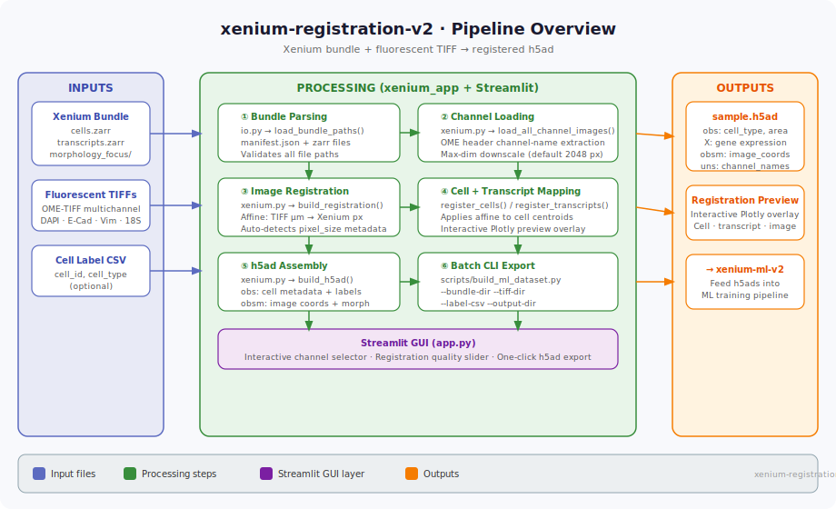

# xenium-registration-v2

**Streamlit app + CLI for co-registering a 10x Genomics Xenium bundle with
external fluorescent TIFF images and exporting an h5ad file.**



---

## Overview

Xenium Explorer bundles contain morphology images alongside spatial
transcriptomics data.  This project registers those
external TIFFs into Xenium pixel coordinates, overlays them interactively with
transcripts and cell outlines, and exports a single `AnnData` (`.h5ad`) file
that downstream ML pipelines can ingest.

```
Xenium bundle + fluorescent OME-TIFFs
          ↓  registration (affine, µm → px)
    Overlay preview (Plotly)
          ↓
    sample.h5ad (obs, X, obsm, uns)
          ↓
  → xenium-ml-v2  (cell-type classification)
```

---

## Inputs

| Source | Format | Notes |
|--------|--------|-------|
| **Xenium bundle** | directory | Contains `manifest.json`, `cells.zarr.zip`, `transcripts.zarr.zip`, `morphology_focus/` |
| **Fluorescent TIFFs** | OME-TIFF (multichannel) | DAPI, E-Cadherin/CD45/ATP1A1, 18S, αSMA/Vimentin |
| **Cell label CSV** | CSV (optional) | `cell_id`, `cell_type` columns; used for supervised export |

### Xenium bundle layout expected

```
my_xenium_run/
├── manifest.json
├── cells.zarr.zip
├── transcripts.zarr.zip
├── cell_feature_matrix.zarr.zip
├── morphology_focus/
│   ├── morphology_focus_0000.ome.tif   ← DAPI
│   ├── morphology_focus_0001.ome.tif   ← ATP1A1/CD45/E-Cadherin
│   ├── morphology_focus_0002.ome.tif   ← 18S
│   └── morphology_focus_0003.ome.tif   ← αSMA/Vimentin
└── analysis_summary.zarr.zip           (optional)
```

> **Channel names**: The app reads all channel names from the OME header in the
> first `morphology_focus_0000.ome.tif` file, which contains the full
> multi-channel manifest.  Individual files each report only "DAPI" in their
> own headers.

---

## Outputs

| File | Description |
|------|-------------|
| `sample.h5ad` | AnnData with `obs` (cell metadata + labels), `X` (gene expression), `obsm["spatial"]` (pixel coords), `obsm["spatial_microns"]` (µm coords), `uns["spatial"]` (images + scalefactors) |
| Registration preview | Interactive Plotly overlay (shown in Streamlit, not saved by default) |

### h5ad structure

```
AnnData object
  obs: cell_id, cell_centroid_x, cell_centroid_y, cell_area, cell_type (if provided)
  var: gene_ids, feature_types
  X:   (n_cells × n_genes) sparse gene expression
  obsm:
    spatial          → pixel coordinates in the stored morphology image (float32)
    spatial_microns  → Xenium µm coordinates (raw from cells.zarr.zip)
  uns:
    spatial:
      <run_name>:
        images:
          hires           → primary channel (float32, [0, 1], percentile-normalised)
          <channel_key>   → additional channels (one per extra OME-TIFF loaded)
        scalefactors:
          tissue_hires_scalef  → ratio stored_image / full_res (< 1 when downscaled)
          pixel_size_um_x      → µm per pixel (x)
          pixel_size_um_y      → µm per pixel (y)
          display_scale        → inverse of tissue_hires_scalef (full_res / stored)
        metadata:
          source_image         → path to primary OME-TIFF
          channel_sources      → {channel_name: tiff_path} for all loaded channels
          registration_source  → which registration transform was applied
          manifest_path        → path to manifest.json
```

> **Image normalisation**: each channel is independently clipped to its own
> [1st, 99th] percentile then scaled to `[0, 1]`.  This preserves relative
> brightness differences between channels (e.g. DAPI vs αSMA) which
> downstream models use for feature extraction.  A global `/max` would
> collapse every channel to the same range and destroy that signal.

---

## Software

| Package | Version | Purpose |
|---------|---------|---------|
| `streamlit` | ≥ 1.55 | Interactive GUI |
| `anndata` | ≥ 0.12 | h5ad read/write |
| `tifffile` | ≥ 2025.0 | OME-TIFF parsing |
| `zarr` | ≥ 3.0 | Xenium zarr stores |
| `imagecodecs` | ≥ 2025.0 | TIFF compression codecs |
| `plotly` | ≥ 6.0 | Interactive overlay figures |
| `numpy` | ≥ 2.0 | Array math |
| `pandas` | ≥ 2.0 | Cell tables |
| `scipy` | ≥ 1.13 | Affine transform fitting |

---

## Installation

### Local

```bash
git clone <repo>
cd xenium-registration-v2
python -m venv .venv && source .venv/bin/activate
pip install -r requirements.txt
```

**Optional — cell-type prediction tab**: the "Run cell type prediction" panel in
`app.py` imports `xenium_ml` from the sibling
[xenium-ml-v2](../xenium-ml-v2/README.md) project.  Install it with:

```bash
pip install -e ../xenium-ml-v2
```

### Docker

```bash
# Build
docker build -t xenium-registration:v2 .

# Run (mount your data directories)
docker run -p 8501:8501 \
  -v /path/to/xenium_bundles:/data:ro \
  -v /path/to/output:/output \
  xenium-registration:v2
```

Then open `http://localhost:8501`.

---

## Usage

### Streamlit GUI

```bash
streamlit run app.py
```

1. Paste / browse to your **Xenium bundle directory**
2. (Optional) Upload a **label CSV** for cell-type annotation
3. Select channels and adjust the registration preview
4. Click **Export h5ad** — file is written to the path shown in the sidebar

### CLI (batch mode)

```bash
python scripts/build_ml_dataset.py \
  --bundle-dir  /data/my_xenium_run \
  --label-csv   /data/labels/sample1_five_class.csv \
  --output      /output/sample1.h5ad \
  --max-dim     2048
```

| Argument | Default | Description |
|----------|---------|-------------|
| `--bundle-dir` | required | Path to Xenium bundle directory |
| `--label-csv` | None | Optional cell-type label CSV |
| `--output` | required | Output `.h5ad` path |
| `--max-dim` | 2048 | Max image dimension (px) for downscaling |

---

## Project Structure

```
xenium-registration-v2/
├── app.py                    # Streamlit entry point
├── xenium_app/
│   ├── __init__.py
│   ├── io.py                 # BundlePaths, manifest parsing
│   ├── xenium.py             # Image loading, registration, h5ad assembly
│   └── plotting.py           # Plotly overlay figures
├── scripts/
│   └── build_ml_dataset.py   # CLI batch h5ad builder
├── tests/
│   └── test_xenium_app.py
├── docs/
│   └── pipeline.svg          # Pipeline diagram
├── requirements.txt
├── Dockerfile
└── README.md
```

---

## Tests

```bash
pytest tests/ -v
```

---

## Relation to xenium-ml-v2

The `.h5ad` files exported by this project are the direct input to
[xenium-ml-v2](../xenium-ml-v2/README.md).  The `xenium_app` package is also
vendored inside `xenium-ml-v2` so the ML pipeline can read morphology images
during feature extraction without requiring the registration app to be installed.
